# MANTRINI

A respectful, offline Japa companion distributed primarily as an Android APK through GitHub Releases.

<div align="center">

## Download MANTRINI for Android

### [CLICK HERE TO DOWNLOAD THE APP](https://github.com/09ashishkapoor/Project_Apex11/releases/latest/download/app-release.apk)

[](https://github.com/09ashishkapoor/Project_Apex11/releases/latest)

Scan this QR code on your Android phone to open the download:


If the direct download does not start, open the [latest GitHub Release](https://github.com/09ashishkapoor/Project_Apex11/releases/latest) and download the APK file attached there.

Prefer a simpler landing page first? Open the website: [09ashishkapoor.github.io/Project_Apex11](https://09ashishkapoor.github.io/Project_Apex11/).

</div>

## App screenshots

Screens are shown in ascending capture order.

| 1 | 2 | 3 | 4 |
| --- | --- | --- | --- |
| 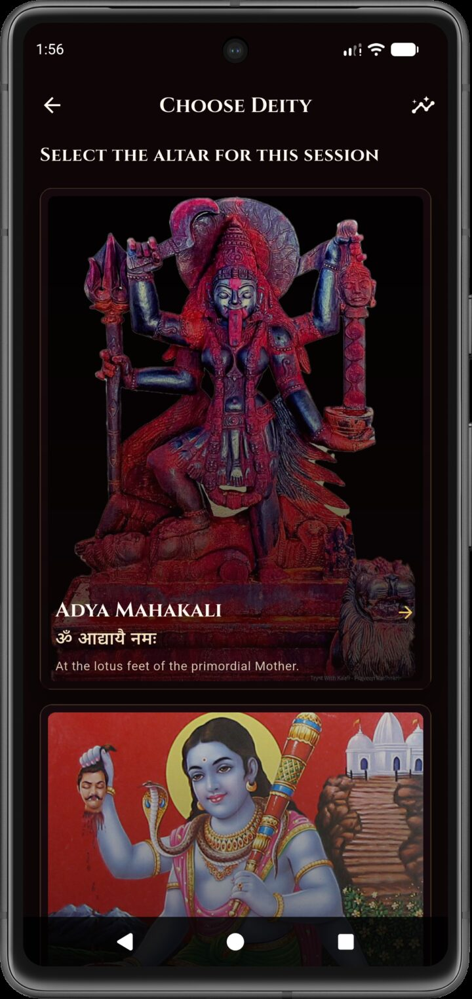 | 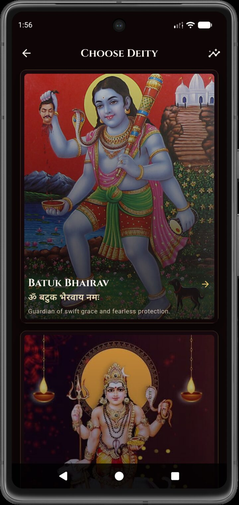 | 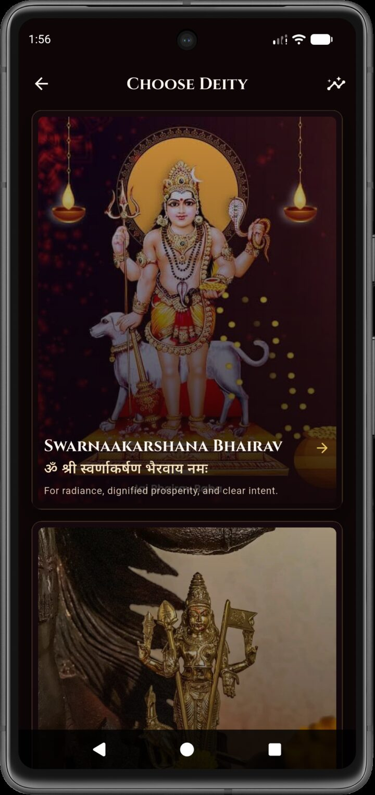 | 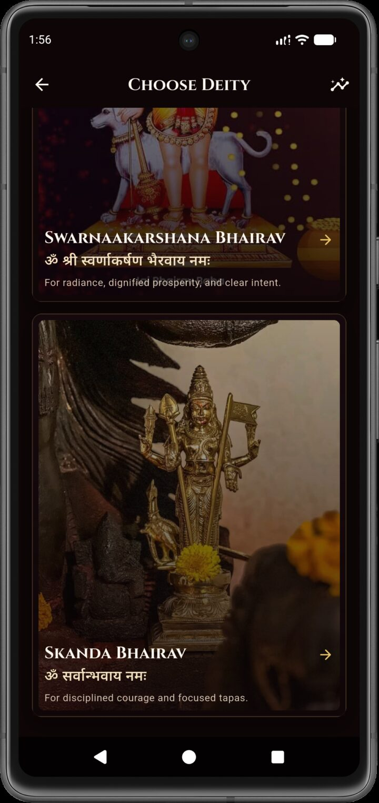 |
| 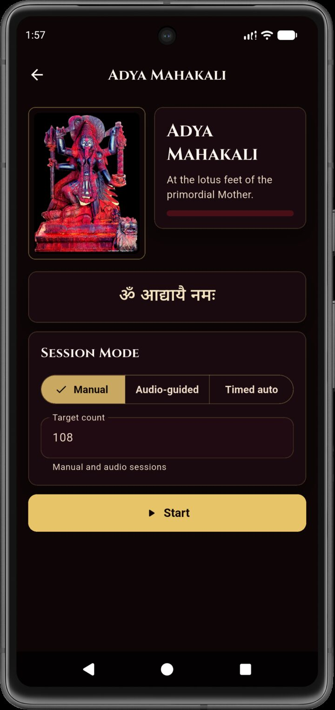 | 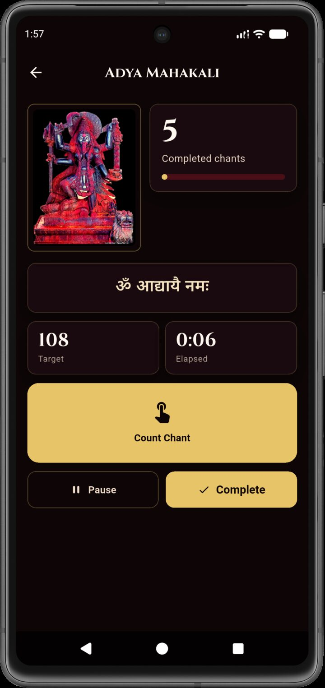 | 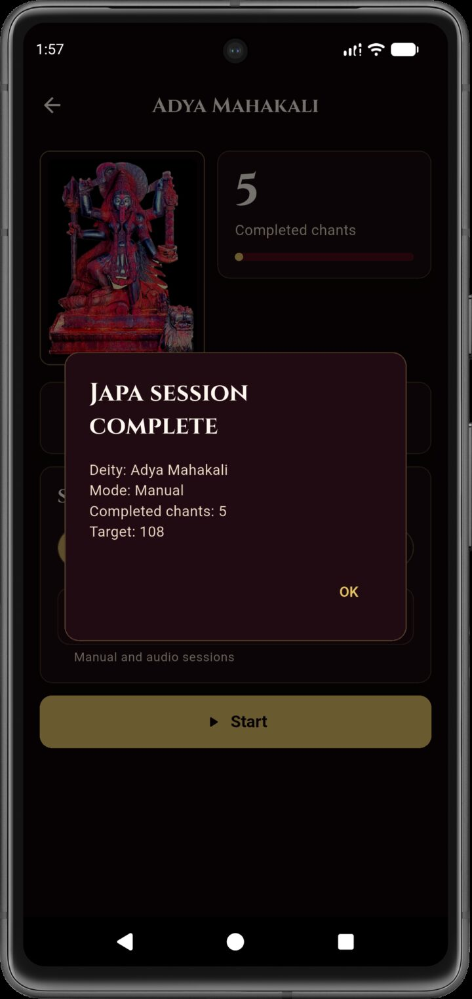 | 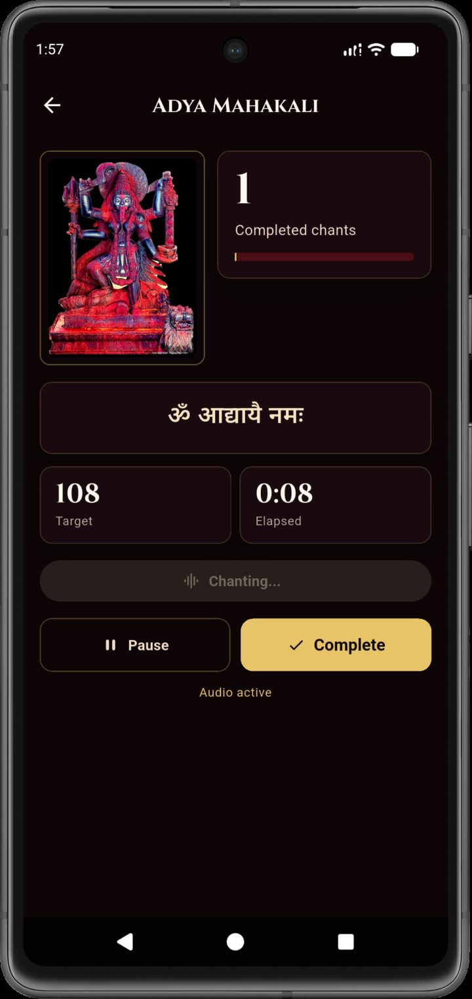 |
| 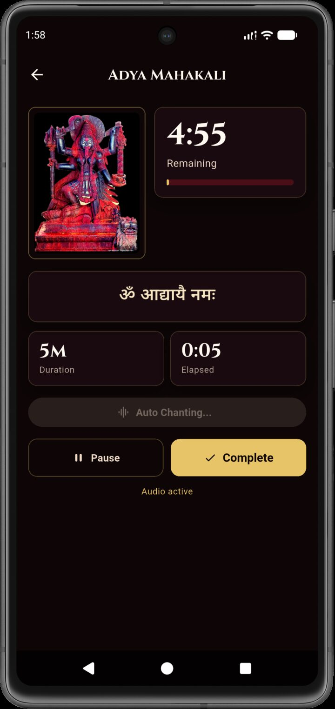 | 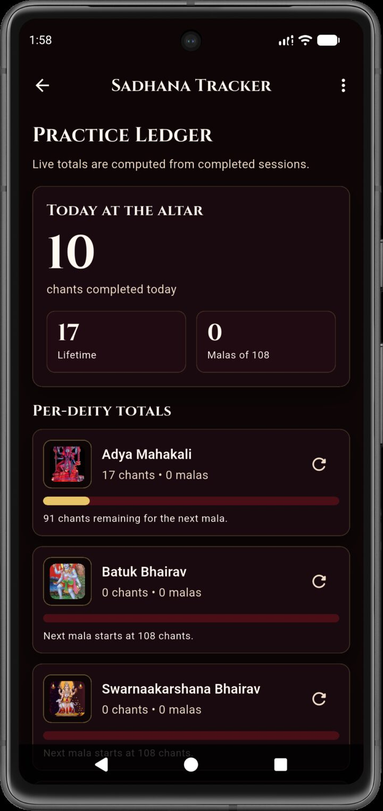 | 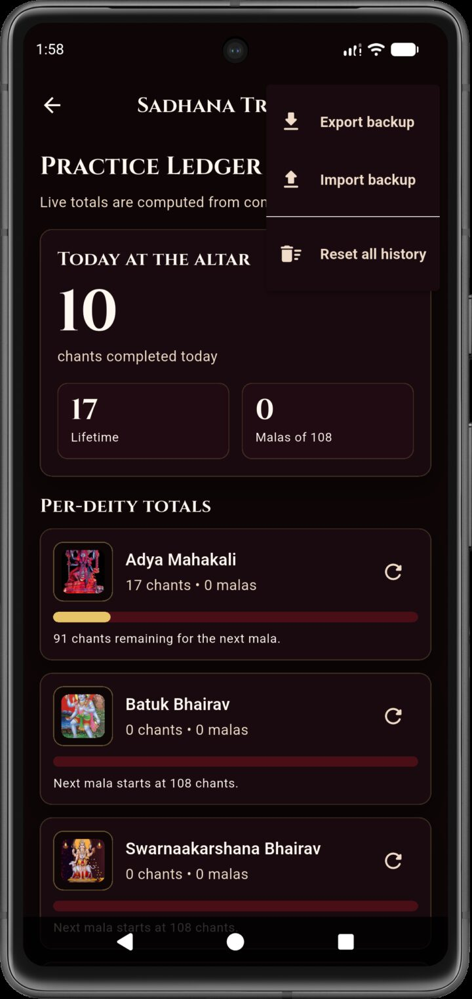 | 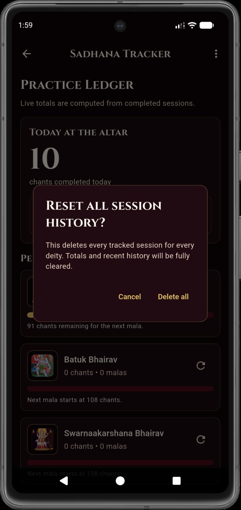 |

## Install on Android

MANTRINI is not distributed through the Google Play Store at this time. The recommended installation path is the signed APK attached to the latest GitHub Release for this repository.

1. Tap **CLICK HERE TO DOWNLOAD THE APP** above.
2. Download the APK file.
3. Transfer it to your Android device if needed.
4. Open the APK on the device and allow installation from that trusted source when Android prompts.
5. After installation, confirm the launcher name is `MANTRINI`.

Only install APKs downloaded from GitHub release pages controlled by this project. Do not install copies from mirrors, reposts, or messaging forwards.

## What it does

- Presents the current four bundled deity/mantra paths.
- Supports manual counting, audio-guided counting, and timed automatic chanting.
- Stores session history locally in Drift/SQLite.
- Computes today totals, lifetime totals, malas of 108, per-deity totals, and recent session history from local data.
- Exports and imports session backups as JSON text.

## What it does not do

- No backend
- No login or accounts
- No payments or subscriptions
- No ads
- No analytics or telemetry
- No cloud sync
- No social features

## Licensing and assets

- App source code is licensed under the MIT License. See `LICENSE`.
- Bundled font files are licensed under the SIL Open Font License. See `assets/fonts/OFL.txt`.
- Bundled devotional images and audio are project assets for MANTRINI distribution only. They are not licensed for reuse outside this app unless you have separate permission from the rights holder.
- If you fork or redistribute this project, replace any image or audio asset whose rights you cannot verify.

## Development

Open the repository root in Android Studio or VS Code:

- [E:\projects\Project_Apex11](E:/projects/Project_Apex11)

Do not open only the `android/` subfolder for Flutter development.

### Required validation commands

```bash
flutter pub get
dart run build_runner build --delete-conflicting-outputs
dart format lib test
flutter analyze
flutter test
flutter build apk --debug
```

### Running on an Android emulator or device

After starting an emulator or connecting a device:

```bash
flutter run
```

If Drift tables or database models change, rerun code generation before `flutter run`:

```bash
dart run build_runner build --delete-conflicting-outputs
```

### Web and desktop targets

- The app is maintained as Android-first.
- Chrome/web may not reflect Android behavior because the app relies on mobile/local database plugins.
- Windows desktop requires its own toolchain and is not the primary validation target for this project.

### Current asset setup

- Android launcher icon uses adaptive icon resources derived from `assets/images/1111.png`.
- Android launcher images currently include:
  - `assets/images/batuk1.jpg`
  - `assets/images/maha1.jpg`

## Android release build

Release signing is loaded from `android/key.properties`.

Expected keys:

- `storeFile`
- `storePassword`
- `keyAlias`
- `keyPassword`

If `key.properties` is missing, debug builds still work, but a release build fails fast instead of falling back to the debug keystore.

After configuring signing:

```bash
flutter build apk --release
```

Publish the generated release APK as a GitHub Release asset. See `RELEASE.md` for sideload guidance, keystore setup, and trusted distribution notes.
